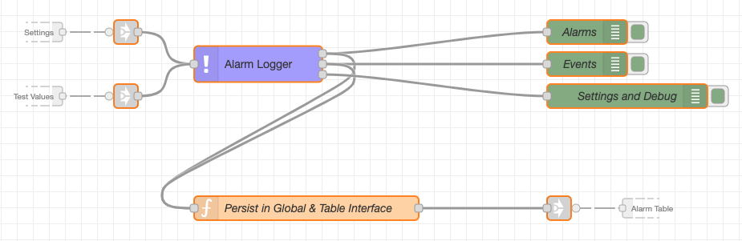
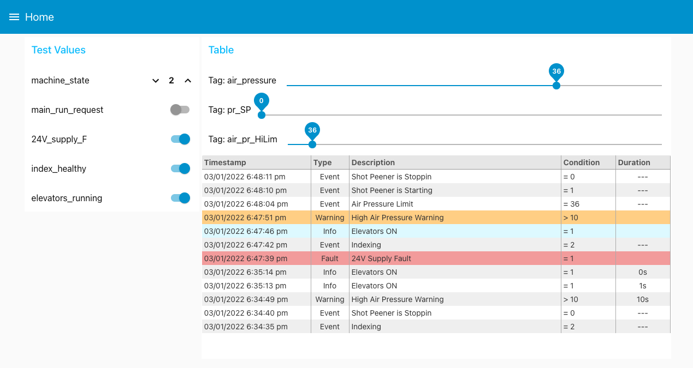
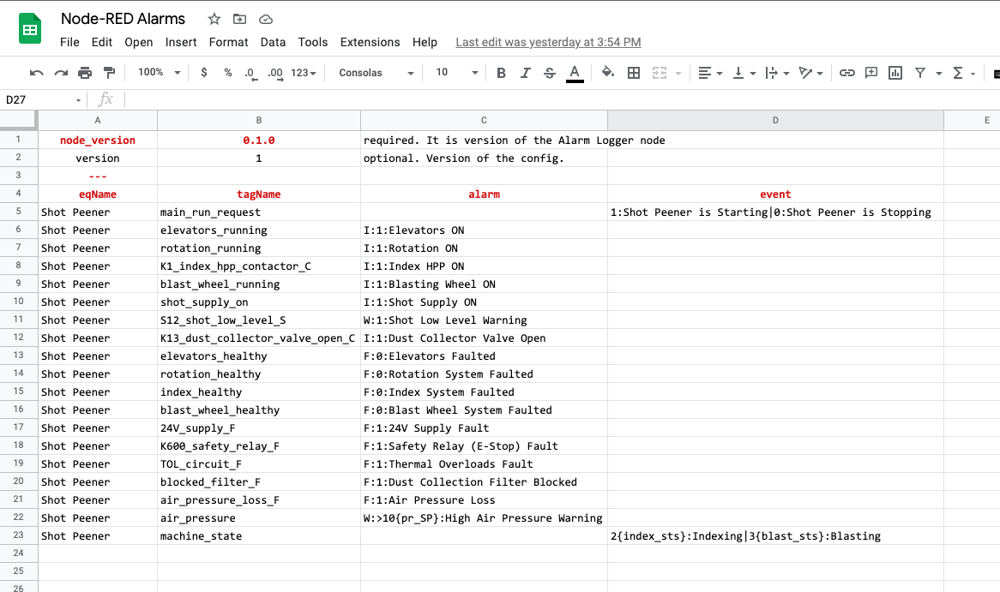

# Simple Node-RED HMI Alarms Logger node

The Alarm Node (logger) is designed to filter and redirect 
events/alarms based on CSV config. This node is designed to be used on industrial 
applications where Node-RED used as HMI (Human Machine Interface).

There are two (2) types of events in this engine:
  - Alarms - an event which has a trigger condition, start timestamp and duration. Alarm can be in two states: `active` and `cleared`. 
    - Info
    - Warning
    - Fault
  - Events - an event which has a trigger condition and start timestamp. Event can be only added. 

Node outputs:
  1. Added or Modified alarms
  2. Added events
  3. Current settings

## Node Usage Screenshots
Flow Usage:


Usage with the [UI Table node](https://flows.nodered.org/node/node-red-node-ui-table)


## Node config
**Name** sets a name for the node.

**Alarm Topic** sets topic for the `output 1`. 

**Event Topic** sets topic for the `output 2`.

**Config Path** sets path to CSV event config.  The path can be relative to the Node-RED project folder or 
an absolute path.

**Toggle to parse the config again** used to re-parse the CSV config. Used when new config uploaded 
with the same path.  

**Debug** produces more logs in the console and the debug pane.

## Event Config
Event config is in CSV format with metadata. A benefit of CSV config is that you can work on 
large number of input data (tags from PLC) in one, easy to see, table.

CSV event config example:



## Incoming messages APIs
Below is type of messages `msg` accepted by the node

### Messages with tag values for alarming
```typescript
interface IProcessData {
    [tagName1: string]: number | boolean,
    [tagName2: string]: number | boolean,
    [tagNameN: string]: number | boolean,
}
interface msg {
    payload: IProcessData
}
```

`msg` example
```json
{
  "payload": {
    "air_pressure": 40,
    "24V_supply_F": true
  }
}
```

### Settings Getters 
#### GET Config
At output 3: Returns the parsed config (from CSV file). 
```typescript
interface msg {
    topic: "__get_config__"
}
```

#### GET Active Alarms
At output 3: Returns an object with currently active alarms in the node.
```typescript
interface msgIn {
    topic: "__get_active_alarms__"
}
```
#### GET Setpoints
At output 3: Returns objects with Setpoints parsed from the config.
```typescript
interface msgIn {
    topic: "__get_setpoints__"
}
```

#### GET Remembered Values
At output 3: Returns an object with remembered tag values (not persistent).
```typescript
interface msgIn {
    topic: "__get_remembered_values__"
}
```

### Settings Setters
#### SET Active Alarms
This is needed to set internal alarm register. The register used to determine when to clear 
the active alarms. Without this register on restart the active alarm could be not cleared.

If using external DB, you  need to query it for active alarm on Node-RED start.

If not using an external DB, save the node output in the persistent `global` context, then on Node-RED 
start use it as an input to this node.

```typescript
interface IActiveAlarm {
    eventId: string,
    isActive: boolean,
    type: "I",
}
interface msg {
    payload: IActiveAlarm[],
    topic: "__set_active_alarms__"
}
```

example `'msg`. Fields `eventId`, `isActive`, `type` are required only, others are optional.
```json
{
  "payload": [
    {
      "ts": 1641192388240,
      "eqName": "Shot Peener",
      "tagName": "24V_supply_F",
      "triggerCond": {
        "op": "=",
        "val": 1
      },
      "eventId": "24V_supply_F::F::0",
      "isActive": true,
      "type": "F",
      "desc": "24V Supply Fault",
      "id": "24V_supply_F::F::0::1641192388240"
    },
    {
      "eventId": "elevators_running::I::0",
      "isActive": true,
      "type": "I"
    }
  ],
  "topic": "__set_active_alarms__"
}
```


#### SET Setpoints
Set Setpoins dynamically based on the tag name in the curly brackets in the CSV config.
```typescript
interface ISetpoint {
    [tagName1: string]: number | boolean,
    [tagName2: string]: number | boolean,
    [tagNameN: string]: number | boolean,
}
interface msg {
    payload: IActiveAlarm[],
    topic: "__set_active_alarms__"
}
```

example `'msg`
```json
{
  "payload": {
    "pr_SP": 12,
    "air_pr_HiLim": 44
  }
}
```